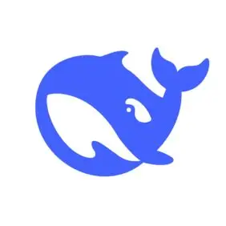

# ⛵ 船只悠悠的小站

> 一条慢悠悠的船，泊在互联网边上。
> 一个整站伪装成"一台老电脑"的手写个人主页——从开机动画、桌面窗口、任务栏，到 CRT 关机、BIOS 重启，全流程都是戏。

**在线访问**：[wezhce.github.io/The-small-station-of-drifting-boats](https://wezhce.github.io/The-small-station-of-drifting-boats/)

| 白天 | 夜航模式（19:00~6:00 自动开启） |
|---|---|
|  |  |

## ✨ 它是什么

- 纯 `HTML + CSS + JS` 单文件手写，**没有框架、没有后端、没有构建**，全部代码在一个 `index.html` 里
- 复古 Win98 视觉：记事本窗口、凹凸按钮、手绘像素画、CRT 开机
- 页脚挂着友情链接：城市宣传页 / 棋艺对弈 / 体素古建 — 都是船长的手笔
- 留言板基于 GitHub Discussions（[giscus](https://giscus.app/zh-CN)），留言永久保存在本仓库里，全世界可见

## 🖥 这台"电脑"有什么

**开机与关机**
- 粒子汇聚开机动画（每个浏览器会话只播一次，尊重系统"减少动态效果"设置，可在网站设置里关闭）
- 首次到访弹出「欢迎登船」信：欢迎语、第 N 次登船（本地计数）、设备建议、探索指南；游客信息里可重读
- 开始菜单 → 关机：CRT 白线坍缩收场；船侧翻睡觉冒 Zzz；再点电源键，BIOS 自检打字 + 蜂鸣，白闪重新开机

**桌面与任务栏**
- 任务栏：开始菜单（系统与设备 / 网站设置：屏保时长·夜航·音效·开机动画 / 游客信息：第 N 次上船·来路·设备 / 关机）、cmd、帮助.chm、计算器、扫雷.EXE、日记.EXE、小站浏览器（只能访问船际网络认证站点：复古主页/BBS/气象台/日报，乱输网址有惊喜）、沙漏.EXE（像素沙漏倒计时，沙子流动可视化）、画板.EXE（24×24 像素画板：画笔/油漆桶/橡皮/撤销，画完一键下载 PNG）、太阳系.EXE（真实比例+真实轨道周期：左侧星球列表点谁去谁、拖动平移、滚轮缩放、点行星看资料并锁定镜头，缩到最小说明什么叫"空"）、倒数日.EXE（内置节日倒数含农历 + 自定义事件可写详细说明，存在本地，谁的日子近谁排前面）、托盘点灯、真实时钟（夜航整栏换深夜配色）
- 仿真 cmd：启动 banner、`↑↓` 历史命令、`help / ver / echo / tree / start / sudo` 等一整套命令（彩蛋无数）
- 帮助.chm：全站彩蛋的官方使用手册（弹窗，可拖动；翻开前有一道"剧透警告"确认，可勾选不再问）
- 所有窗口都能拖标题栏移动、点击置顶

**内容板块**
- 关于我 / 船舱日记（GUI 日历 + 红点标记录日期，近况与日记统一时间线，项目带仓库链接）/ 相册（九本板块相册：像素画集、捣鼓token、校园时光、船长的画、摄影作品、生活碎片、九小回忆 + 两本待填；主页面只陈列封面与简介，双击封面或点「翻开相册」在独立的 相册.EXE 窗口里查看全部图片；灯箱浏览，←→ 切换）/ 留言板（giscus + 全文搜索）
- 漂流瓶：一键从留言里随机捞一条陌生人的话
- 左下角双黑盒小部件：甲板音乐（像素频谱播放器，已上架五首 VOCALOID：初音ミク / 镜音铃 / 重音テト / 影色舞）+ 灵动岛（实时显示游客正在浏览的板块 / 打开的应用 / 挂机状态，记录本次上船时长）

**彩蛋（冰山一角，完整清单在站内 帮助.chm）**
- 站名 / 副标题 / 运行天数 / 板块标题 / 便利贴 / 时钟——挨个点过去，全都有回应
- 小船养成：点右下角小船攒航程，10 海里红帆 / 30 海鸥 / 60 金帆 / 100 夜灯
- Konami Code（`↑↑↓↓←→←→BA`）触发彩虹模式，再输一遍关闭
- 60 秒不动鼠标，屏保自己开演：小船在星空里替你开船
- 同时开 4 个应用触发蓝屏（640K 内存的极限）：任意键退出，全部窗口关闭
- 夜航模式：整站深夜海色，小船点灯，giscus 同步换夜主题

## 🗂 仓库结构

```
├── index.html       全站本体（单文件应用，含全部样式与脚本）
├── 404.html         404 彩蛋页（翻船 + 回甲板）
├── theme.css        giscus 白天主题（羊皮纸）
├── theme-night.css  giscus 夜航主题（深夜海色）
└── docs/            截图与相册图片（campus 校园实拍 / tokens 燃料账单 / art 船长的画 / photo 摄影作品 / life 生活碎片 / jx 九小回忆）
```

## 🔧 想改成你自己的？

所有内容都在 `index.html` 里，搜索关键词即可定位：

| 想改什么 | 搜哪里 |
|---|---|
| 昵称 / 生日 / 社交链接 | `关于我` |
| 日记与近况条目 | `var ENTRIES` |
| 船舱日记 | `var DIARY` |
| 每日副标题 / 宜忌语录 | `SUBS` / `YI` / `JI` |
| 留言板配置 | `GISCUS_CFG`（仓库需开启 Discussions 并安装 [giscus 应用](https://github.com/apps/giscus)） |
| 像素画 | `SPRITES`（16×16 字符画，渲染器自动加描边 / 受光 / 投影 / 光晕） |

## ▶ 本地预览

直接双击 `index.html` 即可（留言板、漂流瓶等功能需要联网）。
或者起个静态服务器：`npx serve .`

## 🤝 贡献者

**船长 · [船只悠悠](https://github.com/WEZHCE)**（[B站](https://space.bilibili.com/1309420497)）— 全部代码的手写人

**AI 船员**

| [DeepSeek](https://github.com/deepseek-ai) | [GLM](https://github.com/zai-org) |
|:---:|:---:|
| <a href="https://github.com/deepseek-ai"></a> | <a href="https://github.com/zai-org"></a> |
| AI 助手 | AI 助手 |

*这台"电脑"一半是人手写的, 另一半是和 AI 一句一句聊出来的。*

## 📄 其他

- © 2026 船只悠悠 — 手写，慢慢更新
- 留言数据保存在本仓库的 [Discussions](https://github.com/WEZHCE/The-small-station-of-drifting-boats/discussions) 里
